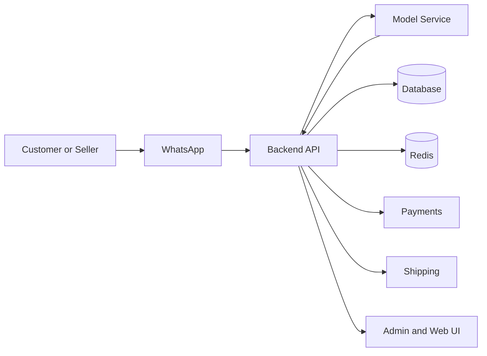

# Architecture

## Purpose

This document explains how Taja fits together as a WhatsApp-first marketplace and where each system belongs.

## System Overview

| Layer | Responsibility |
|---|---|
| WhatsApp layer | Customer and seller entry point, messaging, flows, and interactive actions |
| Backend API | Business logic, users, orders, products, payments, support, and admin tools |
| Model service | Multimodal search and ranking for text, image, video, and voice |
| Web layer | Landing page, admin interface, seller dashboard, receipts, and account management |
| Database layer | Persistent storage for users, orders, products, and platform state |
| Redis layer | Sessions, caching, queues, and operational state |
| External integrations | Payments, shipping, notifications, analytics, and Meta APIs |

## High-Level Flow

## Main Application Surfaces

| Surface | Purpose |
|---|---|
| WhatsApp bot | Primary customer and seller interaction layer |
| Landing page | Public product explanation and conversion |
| Admin dashboard | Internal operations and platform control |
| Seller dashboard | Deeper analytics than WhatsApp chat can provide |
| Digital receipt | Transaction proof and order summary |
| Account deletion page | Safe user self-service privacy control |

## Key Design Rules

| Rule | Why It Matters |
|---|---|
| WhatsApp stays first | The product should feel native to chat users |
| Web is supportive | Web should extend, not replace, the WhatsApp journey |
| Model stays separate | Search intelligence should be isolated from core CRUD logic |
| Admin is privileged | Internal tools need stricter permissions and logging |
| State must persist | Orders, flows, and support cases must survive reconnects and retries |

## Operational Concerns

| Concern | Expected Solution |
|---|---|
| Session state | Persist conversation and workflow state safely |
| Multimodal search | Use model service for text, image, video, and voice note search |
| Interactive forms | Use WhatsApp Flows where available |
| Payment status | Record and verify all transitions |
| Shipping status | Track fulfillment and delivery updates |
| Auditability | Log admin actions and important customer events |

## Summary

The architecture should support a marketplace that feels simple to users while remaining controlled, observable, and scalable behind the scenes.
