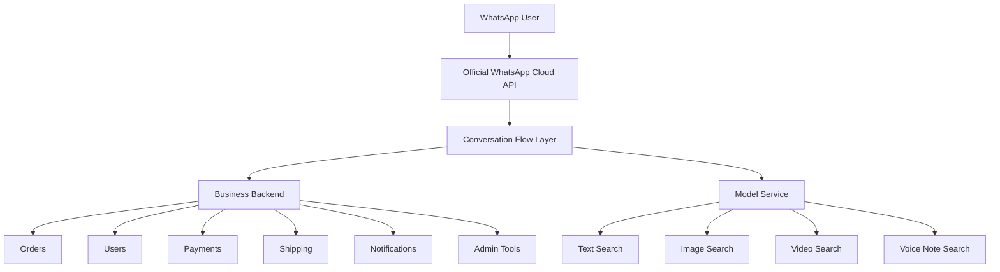

# Product Requirements Document

## 1. Product Overview

### Product Name
Taja

### Repository Name
use-taja-showcase

### Product Type
WhatsApp-first commerce platform

### One-Line Description
Taja is a commerce system that lets customers shop, sellers manage products, and admins operate the marketplace directly through WhatsApp, with official WhatsApp Cloud API support and multimodal search across text, image, video, and voice note.

### Executive Summary

| Field | Details |
|---|---|
| Product | Taja |
| Repository | `use-taja-showcase` |
| Platform | WhatsApp-first commerce |
| Provider Strategy | Official WhatsApp Cloud API only |
| Model Strategy | Separate multimodal model service for search and intelligence |
| Business Type | Small-business commerce infrastructure |
| Primary Users | Customers, sellers, admins, support agents |

### Why This Product Exists
Many small and medium businesses struggle with:

- complicated e-commerce setup
- low conversion from app downloads and web forms
- fragmented support channels
- manual seller onboarding
- difficult product and order management

Taja reduces friction by moving the primary commerce journey into WhatsApp, where users already spend time and are comfortable interacting.

### What Makes Taja Different

| Differentiator | What It Means |
|---|---|
| Multimodal search | Users can search by text, image, video, or voice note instead of only typing keywords. |
| WhatsApp-first commerce | Users can browse, buy, and complete forms inside WhatsApp. |
| Official API support | The production path uses WhatsApp Cloud API features like buttons, lists, and Flows. |
| AI-assisted discovery | The model service helps the platform understand what users mean, not just what they type. |
| Low-friction commerce | The experience is designed for people who do not want to install another app or fill long web forms. |

## 2. Product Vision

### Vision Statement
Build a commerce platform that feels as easy as chatting, but works like a full marketplace.

### Product Promise
Users should be able to:

- discover products
- ask questions
- place orders
- manage products
- complete forms
- receive updates

without leaving WhatsApp for the core customer and seller journey.

### Experience Goal
The product should feel:

- simple
- guided
- trustworthy
- fast
- familiar
- accessible to non-technical users

## 3. Product Goals

### Business Goals

1. Increase conversion by reducing friction in shopping and onboarding.
2. Make seller setup easier so more sellers can join and list products.
3. Reduce support workload through automation and self-service flows.
4. Improve order completion with integrated payments, shipping, and notifications.
5. Create a scalable marketplace operation layer for admins.

### User Goals

1. Customers should find and buy products quickly.
2. Sellers should onboard and manage listings without confusion.
3. Admins should be able to moderate, monitor, and support the platform efficiently.

### Product Goals

1. Keep the core user journey inside WhatsApp.
2. Support official WhatsApp Cloud API features like buttons, lists, and Flows.
3. Keep the system modular so each team can work independently.
4. Make multimodal search a visible product strength so users can search by text, image, video, or voice note.

## 4. Non-Goals

The following are not the primary focus of this product:

- building a general-purpose social network
- replacing a full web storefront entirely
- supporting every country and every payment rail on day one
- building custom enterprise ERP software
- making all workflows text-only

## 5. Target Users

### Customer
People who want to browse, ask questions, add to cart, pay, and track orders in WhatsApp.

### Seller
People or small businesses who want to upload products, manage stock, view orders, and handle payouts.

### Admin
People who manage approvals, moderation, support escalation, analytics, shipping, and platform health.

### Support Agent
People who resolve customer or seller issues and handle escalations.

### Operations Team
People who monitor transactions, shipping, and notifications and need visibility into platform health.

## 6. Core Product Areas

### Customer Experience
- onboarding
- browsing
- search
- cart management
- checkout
- shipping
- payment status
- order tracking
- support

### Seller Experience
- onboarding
- product creation
- product editing
- inventory management
- order handling
- sales reporting
- payout setup
- seller support

### Admin Experience
- user management
- seller verification
- content moderation
- product approval
- broadcast messaging
- analytics
- shipping monitoring
- withdrawal review
- support oversight

### Platform Services
- WhatsApp messaging
- payment processing
- shipping integration
- notifications
- AI-assisted search and support
- session management
- media handling

### Product System Map

### AI and Search Intelligence
- image search
- multi-image search
- video search
- voice note search
- semantic text search
- product deduplication
- product similarity ranking
- trending product scoring

### AI Model Service Role
The model service is a separate backend component that powers multimodal product discovery and product content intelligence.

It is responsible for:

- generating embeddings for product images
- understanding text queries semantically
- extracting representative frames from videos
- comparing customer uploads with product catalog data
- supporting hybrid ranking across text and media
- helping product onboarding detect duplicates or near-duplicates

The model service should be understood by the team as the "search brain" of the platform.

## 7. Primary Product Principles

### Principle 1: Stay Inside WhatsApp
If the official WhatsApp API supports a form, menu, or interactive action, use it before sending users outside the app.

### Principle 2: Use Guided Interaction
Prefer buttons, lists, and structured forms over long text prompts when the user is choosing or submitting structured information.

### Principle 3: Keep Text for Freeform Input
Use plain text only when the user genuinely needs to type open-ended information, such as support details or custom notes.

### Principle 4: Be Clear and Friendly
Every screen, prompt, and message should be understandable by a non-technical user.

### Principle 5: Reduce Repeat Work
Remember user data, session state, and previous choices so users do not repeat themselves unnecessarily.

## 8. User Journeys

### 8.1 Customer Journey

1. User opens WhatsApp and starts the bot.
2. The bot shows onboarding choices.
3. User chooses customer mode.
4. The bot launches the signup flow through the official WhatsApp Flow.
5. User completes account registration.
6. The bot shows the customer menu.
7. User browses products or searches by text, image, video, or voice note.
8. User adds items to cart.
9. User proceeds to checkout.
10. User submits shipping details through a Flow when supported.
11. User confirms order.
12. User receives order and shipment updates.

### 8.2 Seller Journey

1. User opens the bot and selects seller mode.
2. The bot launches the seller signup flow.
3. Seller creates or updates a profile.
4. Seller uploads products with guided prompts.
5. Seller manages inventory, orders, and reports.
6. Seller updates payout details using a Flow.
7. Seller receives sales and order notifications.

### 8.3 Admin Journey

1. Admin logs into the admin panel.
2. Admin reviews users, sellers, products, and orders.
3. Admin approves or rejects content when needed.
4. Admin sends broadcasts or system updates.
5. Admin monitors support, shipping, and withdrawals.

## 9. Functional Requirements

### 9.1 Onboarding

The platform must:

- welcome new users
- let users choose customer or seller paths
- provide FAQs and support access
- launch official WhatsApp Flow signup

| Requirement | Description | Priority |
|---|---|---|
| Welcome routing | Show first-time user options clearly | High |
| User type selection | Customer or seller path selection | High |
| Official signup flow | Use Flow for onboarding in WhatsApp | High |
| Support access | Let users ask for help immediately | High |

#### Acceptance Criteria

- A first-time user sees a clear welcome path.
- The user can continue without leaving WhatsApp.
- The system records user type and session state correctly.

### 9.2 Customer Browsing

The platform must:

- present customer menus using interactive WhatsApp controls where available
- support product browsing and search
- let users add items to cart
- maintain cart state across the session
- support text, image, video, and voice-note search
- support hybrid ranking when multiple signals are present
- show useful search results with clear relevance ordering

| Requirement | Description | Priority |
|---|---|---|
| Menu-based browsing | Use buttons/lists where possible | High |
| Multimodal search | Support text, image, video, and voice note | High |
| Hybrid ranking | Combine multiple input signals | High |
| Cart persistence | Maintain cart across the session | High |
| Relevance display | Show results in meaningful order | High |

#### Acceptance Criteria

- A customer can browse products without needing external navigation.
- Search results remain understandable and actionable.
- Cart updates are reflected accurately.
- A customer can send an image, video, or voice note and receive relevant product matches.
- When both text and media are provided, the search should combine both signals rather than ignoring one.

### 9.2.1 Multimodal Search Requirements

| Search Mode | Input | Model Role | Output |
|---|---|---|---|
| Text Search | Typed query | Semantic embedding and ranking | Ranked product list |
| Image Search | One product image | CLIP-style image similarity | Visually similar products |
| Multi-Image Search | Multiple images | Merge and compare multiple embeddings | Strongest matching products |
| Video Search | Video upload | Frame extraction and frame comparison | Products matching the video content |
| Voice Note Search | Audio message | Speech-to-text plus semantic matching | Ranked products or clarification prompt |
| Hybrid Search | Text plus media | Weighted combination of signals | Best overall match set |

The model-backed search system must support the following modes:

#### Text Search
- Accept natural language descriptions such as product type, style, size, color, or use case.
- Map the query semantically to matching products rather than relying only on exact keywords.
- Support short and long search phrases.

#### Image Search
- Accept one product image from the user.
- Generate a visual embedding using the model service.
- Compare the uploaded image against stored product image embeddings.
- Return the most visually similar products first.

#### Multi-Image Search
- Accept multiple images in one search request.
- Merge similarity signals from the different inputs.
- Rank products by the strongest and most consistent matches.

#### Video Search
- Accept a product video or a customer video reference.
- Extract representative frames from the video.
- Generate embeddings for the frames.
- Compare those embeddings against the product catalog.
- Return products that match the visual content of the video.

#### Voice Note Search
- Accept a WhatsApp voice note or audio message.
- Transcribe the audio into text using the speech pipeline.
- Run the resulting text through the same semantic search engine used for typed queries.
- If transcription confidence is low, fall back to a clarification prompt instead of returning poor matches.

#### Hybrid Search
- When text and media are provided together, combine them into one search strategy.
- Give the most relevant signal more weight depending on the input type.
- Keep the ranking explainable enough for product and support teams to understand.

#### Search Quality Expectations
- Results should feel relevant to the user’s intent, not just technically similar.
- Duplicate or near-duplicate items should be grouped or filtered when appropriate.
- The top results should be easy to act on from WhatsApp.

#### Search Failure Behavior
- If a model request fails, the user should receive a clear fallback message.
- The bot should suggest trying text search, a clearer image, or a shorter voice note.
- Errors should be logged for engineering and operations review.

#### Search Experience Quality

| Quality Aspect | Expected Behavior |
|---|---|
| Relevance | Top results should match user intent closely |
| Confidence | If confidence is low, the system should ask for clarification |
| Speed | Search should feel conversational |
| Explainability | Support and product teams should understand why results were returned |
| Robustness | Duplicate and near-duplicate items should be handled cleanly |

### 9.3 Checkout

The platform must:

- collect shipping details through WhatsApp Flows when supported
- fetch shipping rates
- allow rate selection
- confirm order before finalization
- create shipment records after confirmation

| Requirement | Description | Priority |
|---|---|---|
| Shipping Flow | Collect address in WhatsApp | High |
| Rate selection | Let user choose shipping rate | High |
| Order confirmation | Require a final confirmation step | High |
| Shipment creation | Create shipment after confirmation | High |

#### Acceptance Criteria

- The user is not forced to leave WhatsApp for shipping address entry.
- Checkout can be paused and resumed safely.
- A confirmed order creates the expected backend records.

### 9.4 Seller Product Management

The platform must:

- guide sellers through product creation
- support images and product metadata
- allow editing of existing products
- allow product removal or cancellation
- provide product preview and confirmation actions

| Requirement | Description | Priority |
|---|---|---|
| Product capture | Guided input for images and metadata | High |
| Edit flow | Allow edits before publishing | High |
| Cancellation | Allow sellers to stop a product upload | Medium |
| Validation | Prevent incomplete or invalid product records | High |
| Preview step | Show sellers what will be published | High |

#### Acceptance Criteria

- Product creation follows a predictable flow.
- The seller can confirm, edit, or cancel before publishing.
- Validation prevents incomplete product submissions.

### 9.5 Seller Payouts

The platform must:

- let sellers update payout details through WhatsApp Flows when supported
- store bank account information securely
- expose payout status through the backend and admin tooling

| Requirement | Description | Priority |
|---|---|---|
| Payout Flow | Use WhatsApp Flow when available | High |
| Secure storage | Store payout details safely | High |
| Validation | Reject incomplete payout details | High |
| Visibility | Allow admin and seller status checks | Medium |

#### Acceptance Criteria

- Payout form submission updates the seller record.
- Incomplete payout details are rejected.
- The seller is not sent to an external web page.

### 9.6 Support

The platform must:

- offer automated support responses
- escalate urgent cases
- keep support context across a reasonable conversation window
- support a form-based intake for structured support requests

| Requirement | Description | Priority |
|---|---|---|
| AI triage | Sort issues before human escalation | High |
| Conversation memory | Keep enough history to remain useful | High |
| Support flow | Structured support intake through WhatsApp Flow | Medium |
| Human escalation | Hand off urgent issues quickly | High |

#### Acceptance Criteria

- A user can ask a question and get a response without losing context.
- Urgent issues are flagged for human escalation.
- Support can continue inside WhatsApp with structured flows when available.

### 9.7 Notifications

The platform must:

- notify users about orders, shipping, and support updates
- notify sellers about new orders and important business events
- support broadcast and system notifications from admin tools

#### Acceptance Criteria

- Notification delivery is recorded.
- Failures are visible in logs or admin views.

### 9.8 Admin Controls

The platform must:

- allow admins to view platform metrics
- approve or reject relevant content
- manage users, sellers, couriers, and categories
- view reports and withdrawals

#### Acceptance Criteria

- Admin actions are permission-checked.
- Actions are auditable.

## 10. WhatsApp Interaction Rules

### Buttons
Use buttons when the user has a small number of clear decisions.

### Lists
Use lists when the user needs to pick from several related options or categories.

### Flows
Use WhatsApp Flows for forms that collect structured data such as:

- signup
- shipping address
- payout details
- support intake

### Text
Use free text for:

- custom questions
- product search
- support explanations
- optional notes

### Voice Notes
Voice notes should be treated as structured input for search or support, not as a dead-end attachment.

When a voice note arrives:

1. detect whether it is intended as search or support
2. transcribe the audio
3. continue the journey using the transcript
4. only ask the user to repeat themselves if the transcription is unusable

### Interaction Priority Table

| Interaction Type | Best Use | Notes |
|---|---|---|
| Button | 2-3 clear choices | Fastest decision path |
| List | Several related choices | Good for menus and categories |
| Flow | Structured form input | Best for signup, shipping, payouts, support |
| Text | Open-ended input | Use for search, notes, and explanation |
| Voice | Rich intent or support | Transcribe before processing |

## 11. Information Architecture

### Main Top-Level Areas

1. Customer
2. Seller
3. Support
4. Admin
5. Notifications
6. Payments
7. Shipping

### Session Concepts

- user type
- current state
- step within a flow
- active cart
- shipping details
- selected product or order
- support context

## 12. UX Requirements

### Tone
- friendly
- concise
- human
- reassuring
- clear

### Layout in WhatsApp
- start with the action the user should take
- keep instructions short
- avoid long paragraphs where buttons or flows are better
- always provide a way to go back

### Accessibility
- use simple language
- avoid jargon
- keep interactions predictable
- support users with limited digital literacy

### Error Handling
- explain what went wrong
- tell the user what to do next
- keep them in the flow when possible

## 13. Data Requirements

### Customer Data
- phone number
- name
- email
- account status
- cart data
- order history
- shipping address

### Seller Data
- business name
- payout details
- product listings
- sales data
- order handling data

### Admin Data
- permissions
- approval history
- broadcast history
- support logs
- analytics

### Model Data
- product image embeddings
- text embeddings
- video frame embeddings
- image hashes
- similarity scores
- search metadata
- duplicate detection metadata
- trending scores

### Search Input Data
- text queries
- image uploads
- video uploads
- voice note transcripts
- hybrid query payloads

## 14. Platform Requirements

### Backend
- must be reliable
- must separate message handling from business logic
- must support sessions and persistence

### Messaging
- must support official WhatsApp Cloud API
- must support interactive messages and form flows

### Operating Model Table

| Layer | Responsibility | Example |
|---|---|---|
| Chat layer | User interaction and session routing | WhatsApp menus and Flows |
| Business backend | Orders, users, payments, shipping | Checkout and seller operations |
| Model service | Visual and semantic intelligence | Image, video, and voice-note search |
| Admin layer | Moderation and reporting | Approvals and analytics |
| Evidence layer | Logs and business proof | AI logs, receipts, customer data |

### Model and Search Platform
- must support a separate model service for multimodal search
- must support image, video, and voice-note search inputs
- must support semantic text search
- must support product embedding generation and similarity scoring
- must support duplicate detection and ranking assistance
- must keep model behavior observable through logs and health checks

### System Health Table

| Service | What Must Be Healthy | Why It Matters |
|---|---|---|
| WhatsApp API | Webhooks, messages, interactive actions | Core user interface |
| Backend API | Orders, users, notifications, sessions | Business operations |
| Model service | Embedding generation and search | Multimodal discovery |
| Redis | Sessions and cache | Speed and reliability |
| Supabase/Postgres | Persistent business data | Data integrity |

### Storage
- must support persistent records for users, products, orders, and sessions
- must retain message history according to the product needs

### Performance
- responses should be quick enough for chat UX
- menus and flow launches should feel immediate
- search jobs should return results fast enough to feel conversational, with async processing if needed for heavier inputs such as video

### Security
- verify webhook authenticity
- protect secrets in environment variables
- enforce permissions for admin routes
- avoid exposing payout or user data to unauthorized users

## 15. Non-Functional Requirements

### Reliability
- minimize downtime
- recover from transient failures
- keep sessions safe during restarts

### Scalability
- support more users without reworking the core flow model

### Maintainability
- keep modules separated by concern
- use provider-neutral interfaces where possible

### Observability
- log important workflow states
- make errors diagnosable
- expose health checks where useful
- expose model health, embedding health, and search job health where possible

### Testability
- critical flows should be testable end-to-end
- acceptance criteria should map to test cases

## 16. Edge Cases

The platform should handle:

- user returns after a timeout
- user sends unexpected text instead of choosing a button
- webhook retries and duplicate messages
- interrupted Flow submission
- missing user records
- missing payout information
- unsupported or invalid shipping data
- payment failure
- shipping API failure
- support escalation

## 17. Risks And Constraints

### Risks
- structured flows require careful Meta setup
- shipping and payment dependencies can fail externally
- inconsistent session state can confuse users
- multimodal search quality depends heavily on model tuning and catalog data quality
- voice-note transcription quality can affect search relevance
- video search can be slower and more expensive than text or image search

### Constraints
- some form logic may need backend validation even if the UI is in WhatsApp
- international support may require future product decisions
- model service may require more memory and compute than the chat backend

## 18. Success Metrics

### Product Metrics
- signup completion rate
- cart-to-checkout conversion rate
- order completion rate
- payout update completion rate
- support resolution rate
- time to first response
- text search success rate
- image search success rate
- video search success rate
- voice note search success rate
- average search-to-click conversion rate
- search result relevance score

### Operational Metrics
- webhook success rate
- notification delivery success rate
- API error rate
- session recovery rate
- model inference success rate
- transcription success rate
- average model response latency
- duplicate detection accuracy

| Metric Group | Target Direction |
|---|---|
| Search relevance | Increase over time |
| User completion rate | Increase over time |
| Support resolution | Increase over time |
| Model latency | Decrease over time |
| Manual intervention | Decrease over time |

### Business Metrics
- seller activation rate
- repeat purchase rate
- abandoned cart reduction
- support ticket reduction

## 19. Milestones

### Phase 1
- official WhatsApp Cloud API support
- menus, buttons, lists, and Flows
- user onboarding
- seller onboarding
- checkout shipping flow
- semantic text search
- image search through the model service

| Phase | Deliverable | Outcome |
|---|---|---|
| 1 | Core WhatsApp commerce flow | Users can complete key journeys |
| 1.5 | Multimodal search expansion | Users can search with media |
| 2 | Operational tooling and tuning | Team can manage and improve quality |
| 3 | Growth and scale improvements | Business can continue beyond the hackathon |

### Phase 1.5
- multi-image search
- video search
- voice-note search through transcription
- hybrid ranking between text and media
- product similarity and deduplication support

### Phase 2
- richer support flows
- deeper admin tooling
- analytics and reporting improvements
- search quality tuning and relevance measurement
- model health and observability dashboards

### Phase 3
- optimization, scale, and expansion
- additional countries or business rules
- richer automation

## 20. Team Notes

### For Product
Define clear priorities and keep the journey simple.

### For Design
Design for trust, speed, and clarity inside chat.

### For Engineering
Keep WhatsApp logic official-API-native and use shared interfaces.

The model service should be treated as a first-class backend system, not a loose helper script.
The chat backend should call the model service through clear contracts for text, image, video, and voice-note search.

### For QA
Test happy paths, failures, duplicates, and partial completions.

Also test search with:

- one image
- multiple images
- one video
- a voice note
- mixed text + media
- no-match results
- low-confidence transcription

### For Support
Document the most common user issues and escalation rules.

### For Operations
Monitor webhook reliability, payment events, shipping events, and support volume.

## 21. Glossary

- **Flow**: A structured form or guided interaction inside WhatsApp.
- **Provider**: The WhatsApp integration layer, which is the official Cloud API for this product.
- **Session**: The saved state of a user’s current chat journey.
- **Checkout**: The process of selecting shipping, confirming the order, and completing the purchase.
- **Payout**: The seller’s settlement or withdrawal details.
- **Escalation**: Handing a support issue to a human team member.
- **CLIP**: A multimodal model used to compare images and text in the same embedding space.
- **Embedding**: A numeric representation of text, image, or video content used for similarity search.
- **Hybrid Search**: A search strategy that combines multiple signals, such as text and image, before ranking results.
- **Voice Note Search**: Search initiated from an audio message that is transcribed and then matched semantically.

## 22. Decision Framework

When choosing how to build a new feature, the team should ask:

| Question | If Yes | If No |
|---|---|---|
| Can the official WhatsApp API support it? | Build it in WhatsApp first | Use a companion web surface only if absolutely necessary |
| Is the input structured? | Use a Flow | Use buttons or text |
| Does the model improve the result? | Route through the model service | Keep it in the backend |
| Is the action sensitive or important? | Add validation and confirmation | Keep it lightweight |
| Will humans still need to review it? | Add escalation and audit logs | Automate if safe |

## 23. Final Product Statement

Taja should feel like a full commerce platform hidden inside a simple WhatsApp conversation.

The product wins when users can complete important tasks quickly, safely, and without leaving the app.
