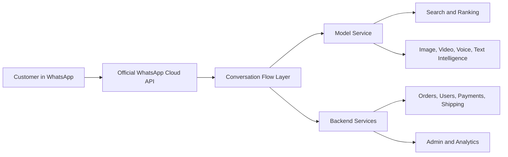
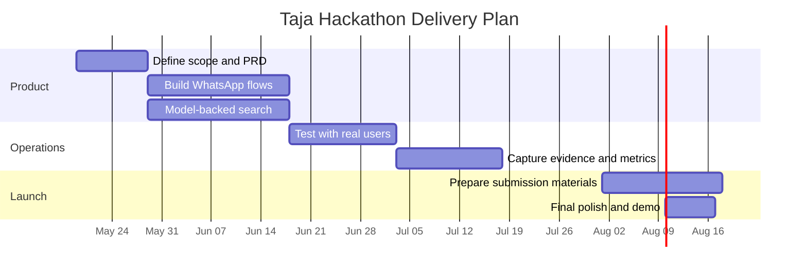

# Project Goal

## Executive Summary

| Field | Details |
|---|---|
| Project | Taja |
| Repo | `use-taja-showcase` |
| Hackathon | Build with Gemini XPRIZE |
| Category | Small Business Services |
| Business Type | WhatsApp-first commerce platform |
| Core Advantage | AI-native operations inside WhatsApp |
| Product Outcome | Real users, real usage, real revenue potential |

## Why We Are Building Taja

Taja exists to make commerce easier for small businesses and their customers.

| Problem | What Taja Does |
|---|---|
| Customers switch between apps and websites | Keeps the journey inside WhatsApp where possible |
| Sellers struggle with setup and operations | Provides guided onboarding, product tools, and payout flows |
| Support is slow and fragmented | Uses AI-assisted support and escalation paths |
| Search is weak or keyword-only | Uses multimodal search through the model service |
| Teams need proof of business viability | Collects usage, revenue, and operational evidence |

## Hackathon Category Fit

| Category | Fit Level | Why It Fits |
|---|---:|---|
| Small Business Services | Strong | The product helps small businesses sell and operate |
| Entrepreneurship & Job Creation | Strong | It creates tools for new founders and sellers |
| Professional Services Access | Medium | It reduces friction in getting help and support |
| Money & Financial Access | Medium | It supports payouts, order flows, and transaction handling |

## What Success Means

| Success Area | Evidence We Want |
|---|---|
| Real users | Actual customers and sellers using the system |
| AI in production | Live execution logs from search, support, and flows |
| Revenue | Transactions, receipts, or business evidence |
| Usability | Users can complete tasks without leaving WhatsApp unnecessarily |
| Reliability | The system handles retries, errors, and state safely |
| Growth | The business can continue after the hackathon |

## What AI Does Versus What Humans Do

| Area | AI Responsibility | Human Responsibility |
|---|---|---|
| Search | Image, video, voice note, and text understanding | Quality review and tuning |
| Support | Triage, routing, response drafting | Escalation and final resolution |
| Onboarding | Guided form completion and validation | Product decisions and approvals |
| Product discovery | Similarity ranking and relevance | Merchandising and oversight |
| Operations | Pattern detection and decision support | Final business judgment |

## Core Operating Model

## Day-One Product Loop

| Step | Action |
|---|---|
| 1 | Customer opens WhatsApp and starts the bot |
| 2 | Bot shows menus, buttons, or Flows |
| 3 | User searches, browses, or asks for help |
| 4 | Model service interprets text, image, video, or voice note |
| 5 | Backend returns ranked products, support responses, or next steps |
| 6 | User checks out, submits forms, or escalates to support |
| 7 | System logs the action and keeps the session state |

## Evidence Needed For Judges

| Evidence Type | Example |
|---|---|
| Product proof | Screenshots of flows, dashboards, and search results |
| AI proof | Logs showing model use, inference, and routing decisions |
| Business proof | Revenue records, transaction logs, or P&L data |
| Customer proof | Feedback, testimonials, contact details, or usage records |
| Delivery proof | GitHub repo, deployed app, and API records |
| Growth proof | Customer acquisition spend and marketing results |

## Timeline View

## Final Statement

Taja is being built as a real AI-native commerce business, not a demo. The goal is to show that a small team can run a useful, revenue-capable product where WhatsApp, AI, and operational tooling work together in production.
